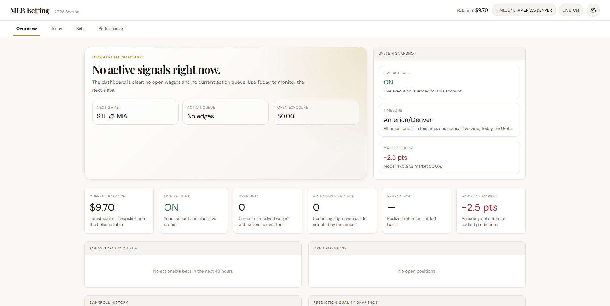

<p align="center">
  
</p>

<h1 align="center">MLB Pipeline</h1>

<p align="center">MLB betting intelligence system with ML-driven predictions, live execution on Kalshi, and transparent performance analytics.</p>

<p align="center">
  <a href="/actions/workflows/test.yml">
    /<repo>/test.yml?branch=main&label=tests" alt="Tests">
  </a>
  <a href="#license">
    
  </a>
  <a href="https://github.com/<owner>/<repo>">
    
  </a>
</p>

<p align="center">
  
</p>

## What It Does

MLB Pipeline predicts MLB game outcomes using ML models and executes trades on [Kalshi](https://kalshi.com):

1. **Data collection** — fetches schedules, odds, weather, pitcher stats, team statistics
2. **Feature engineering** — builds 80+ game-level features from multiple data sources
3. **Prediction** — Logistic Regression (default), LightGBM, XGBoost, or MLP models
4. **Early-season specialist** — separate LR model for teams with <25 games played
5. **Market comparison** — model predictions vs. market odds find edge
6. **Execution** — places bets on Kalshi (live or dry-run)
7. **Settlement** — resolves bets post-game, tracks ROI

## Architecture

- **Dashboard** — FastAPI app serving public analytics + private operator controls (port <REDACTED_PORT>)
- **Pipeline** — Orchestrator that runs 15 min before each game, executes predictions and bets in parallel
- **Model** — Logistic Regression (default) with isotonic calibration, plus LightGBM, XGBoost, MLP, or ensemble options; walk-forward validation
- **DB** — PostgreSQL for bets, balances, and history

## Key Components

```text
run_pipeline.py     # Main orchestrator — runs prediction + bet pipeline
dashboard/app.py     # FastAPI dashboard — public analytics, private controls
model/train.py     # Model training — LR/LightGBM/XGBoost/MLP/ensemble + walk-forward
model/predict.py  # Inference — produces win probabilities + Kelly stake sizing
bet/place_bet.py  # Bet execution — Kalshi API integration
db.py             # PostgreSQL access
fetch/            # Data ingestion — odds, weather, stats
```

## Running Locally

```bash
uv sync
uv run pytest -q tests/
uv run uvicorn dashboard.app:app --reload --host <bind_addr> --port <REDACTED_PORT>
uv run run_pipeline.py
```

See [.env.example](./.env.example) for required environment variables.

## Deployed

Push to GitHub → auto-deploys to homelab LXC. Dashboard lives at the deployed URL.

SSH debugging via [`homelab.py`](./homelab.py):

```bash
python3 homelab.py app "systemctl status mlb-dashboard --no-pager -l | tail -40"
python3 homelab.py app "journalctl -u mlb-dashboard -n 100 --no-pager"
```

## Data Sources

- [MLB Stats API](https://statsapi.mlb.com)
- [The Odds API](https://the-odds-api.com)
- [Kalshi](https://kalshi.com)
- [Open-Meteo](https://open-meteo.com)
- [FanGraphs](https://www.fangraphs.com)

## Docs

- [Program overview](./docs/PROGRAM.md)
- [Model workflow](./docs/run_model.md)
- [Kalshi integration](./docs/kalshi.md)
- [Auto-deploy](./docs/auto_deploy.md)

## License

AGPL-3.0